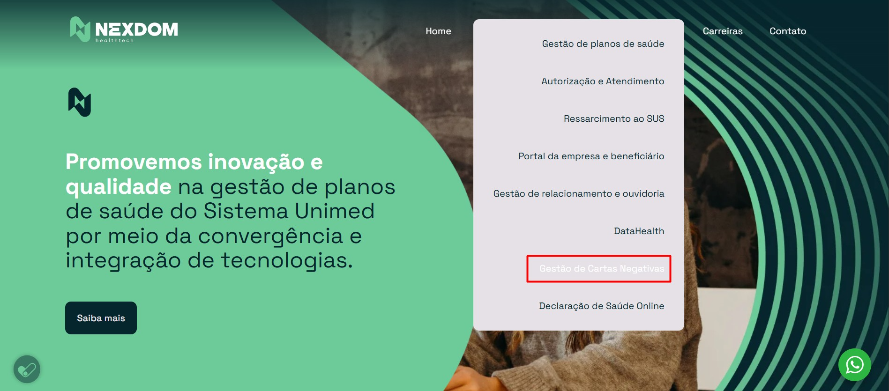

# BUGS ENCONTRADOS:

## BUG 01 — [Menu Soluções] Cor do título “Gestão de Cartas Negativas” difere das demais

# Descrição: 
Foi identificado uma divergência visual no Menu Soluções da página inicial.
A opção “Gestão de Cartas Negativas” está com o título com a cor branca, enquanto as outras opções do menu estão com seus títulos na cor preta.

## Passos para Reprodução:
1. Acessar a página “https://nexdom.tec.br/”.
2. Navegar até o menu "Soluções"" no cabeçalho da página.
3. Localizar a opção “Gestão de Cartas Negativas” 
4. Comparar a cor do título com as outras opções disponíveis no menu.

# Resultado Obtido:
O título “Gestão de Cartas Negativas” é demonstrado com a cor branca, enquanto as outras opções do menu estão com seus títulos na cor preta.

# Resultado Esperado:
O título “Gestão de Cartas Negativas” deve aparecer com a mesma cor conforme as demais opções seguindo o padrão visual da interface do site.

# Evidências:

# Ambiente: 
Produção, navegador Chrome.

//////

### BUG 02 — [Formulário de Contato] Ao tentar enviar o formulário de contato apenas com os campos obrigatórios preenchidos, a página não solicitou que o checkbox de “Li e aceito os termos de uso” fosse marcado. 

# Descrição: 
Foi identificado um comportamento divergente no Formulário de Contato.

Ao preencher os campos obrigatórios Nome, E-mail e Empresa, manter o checkbox “Li e aceito os termos de uso” desmarcado e clicar no botão “Enviar”, o formulário permite o envio sem apresentar uma validação ou mensagem solicitando o aceite dos termos.

# Passos para Reprodução:
1. Acessar a página “https://nexdom.tec.br/”.
2. Navegar até o menu Contato no cabeçalho da página.
3. Preencher os campos obrigatórios: "Nome", "E-mail", "Empresa". 
4. Manter o checkbox "“Li e aceito os termos de uso” desmarcado.
5. Clicar no botão "Enviar".

# Resultado Obtido:
O formulário permite o envio mesmo com o checkbox “Li e aceito os termos de uso” desmarcado.

Não é apresentada uma mensagem de validação solicitando que o usuário marque o checkbox antes do envio.

# Resultado Esperado:
Caso o aceite dos termos de uso seja um requisito obrigatório, o formulário deve impedir o envio enquanto o checkbox “Li e aceito os termos de uso” estiver desmarcado e apresentar uma mensagem orientando o usuário a realizar o aceite.

# Evidências:

# Ambiente: 
Produção
Navegadores: Chrome, Firefox, EDGE .

# Observação:
Não foram disponibilizados os requisitos funcionais ou a documentação do Formulário de Contato para confirmar se o aceite do checkbox “Li e aceito os termos de uso” é uma condição obrigatória para o envio.

Dessa forma, o comportamento foi registrado como ponto de atenção, devendo ser validado com o requisito de negócio.

Do ponto de vista de experiência e segurança LGPD, é necessário confirmar se o aceite dos termos deve ser obrigatório antes do envio do formulário.

/////

